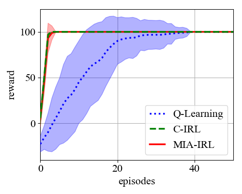
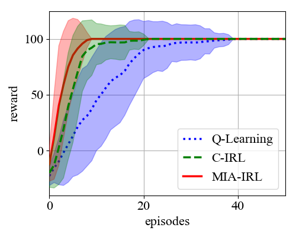
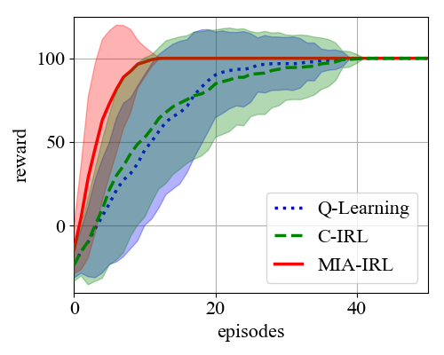
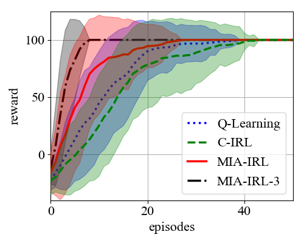

#### Interactive Reinforcement Learning with Bayesian Fusion of Multimodal Advice

This repository is the official implementation of the paper "Interactive Reinforcement Learning with Bayesian Fusion of Multimodal Advice". We propose the novel approach Multimodal IOP-Based Advice for Interactive Reinforcement Learning (MIA-IRL) to integrate human advice from multiple modalities into IRL algorithms, which uses the Bayesian fusion method Independent Opinion Pool (IOP) for fusing the output distributions of the modalities' individual classifiers.

The repository contains the code required for reproducing the simulated results given in the manuscript, i.e. Figure 3(b), (c), (d), and (e). Thus, it compares the proposed IRL algorithm to standard non-interactive Q-Learning and the related approach by Cruz et al. (2018), C-IRL, in a grid world scenario using simulated advice for two (or three) simulated modalities' classifiers.

#### Requirements:

The provided code runs on Ubuntu 16.04/18.04 with Python 2.7.18.

To install required packages type:

	pip install -r requirements.txt

#### Files:

- **irl_module.py**:
irl_module.py is the starting point for reproducing the simulated results given in the paper. It contains the functionality for evaluating all compared (I)RL approaches and plotting the resulting learning curves.

- **rl_module.py**:
In rl_module.py the RlModule class is implemented, which contains all functionality for Q-Learning in a given grid world. The Q-learning algorithm chooses the action proposed by the learned Q-values if no advice is given. If advice is given, the action proposed by fusion_module and action_selection_module is selected. 

- **fusion_module.py**:
fusion_module.py contains the FusionModule class, which contains the code for fusing categorical distributions according to Independent Opinion Pool as well as according to the fusion method proposed in Cruz 2018 for comparison.

- **action_selection_module.py**:
In action_selection_module.py the ActionSelectionModule class is implemented, which contains different methods for selecting an action from a categorical distribution over actions. In particular, the action can be chosen by sampling, as we propose for our approach, or by taking the action with the highest probability if it is above a specified threshold, as proposed by the compared approach by Cruz et al. (2018).

- **modality.py**:
In modality.py the Modality class is implemented, which serves for simulating advice for the modalities. Thus, it simulates categorical output distributions, which normally would be the output of modality classifiers. The simulated advice can be either correct or incorrect, certain or uncertain.

#### Folders:

- **envs**
envs contains the grid plan for the used grid world (in grid_plans), the images used for rendering the grid world (in img), and the script taxi.py, which contains the functionality for setting up the grid world and navigating in it.

- **plots**
plots contains the 4 plots showed below, i.e. Figure 3(b), (c), (d), and (e) in the manuscript.

- **policies**
policies contains the correct policy for the used grid world. This policy is needed for generating the simulated feedback (to know which action is the correct one).

#### Results:

If you run

	python irl_module.py b

you can replicate Figure 3(b) in the paper:

If you run 

	python irl_module.py c

you can replicate Figure 3(c) in the paper:

If you run 

	python irl_module.py d

you can replicate Figure 3(d) in the paper:

If you run 

	python irl_module.py e

you can replicate Figure 3(e) in the paper:

